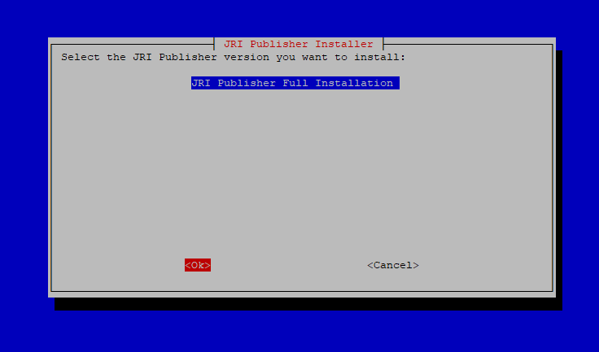
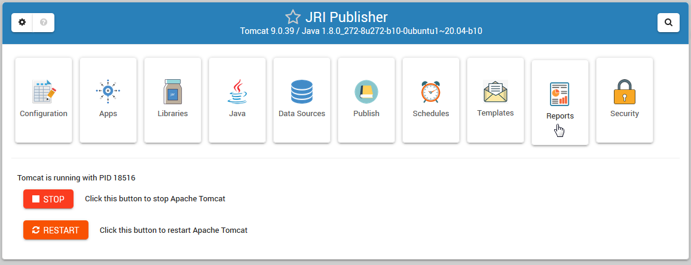

# Jasper Publisher

Webmin module for installing, configuring, and managing JasperReportsIntegration.

# About

Jasper Publisher is a Webmin module that installs, configures, and manages Tomcat, Java, and JasperReportsIntegration

It also provides Publishing, Scheduling, Email Templates, and Report Management.

It can be used with Oracle (with or without Oracle APEX), PostgreSQL, MySQL, and Microsoft SQL Server.

# Docs

https://jripub.davidghedini.com

# Operating Systems

Ubuntu 22 LTS

Rocky Linux 9

# Run the Installer:

1. Issue below to launch the Installer

            wget https://raw.githubusercontent.com/cited/jri-publisher/master/scripts/jri_publisher-installer.sh && chmod +x jri_publisher-installer.sh && ./jri_publisher-installer.sh

3. Follow the prompts to install

 

3. Upon completetion, below will be displayed::

        Version: JRI Publisher Full Installation
        Control Panel Modules: jri_publisher certbot
        Tomcat Version: 9
        Java Version: OpenJDK
            Installation is now completed.
            SSL Provisioning Success.

4. Click the Login link on the home page to log in.

# 2.10.1 Release Notes

* Updated for JaseperReportsIntegration latest releases
* Support for Ubuntu 22 LTS and Rocky Linux 9
* Fixed PostgreSQL JNDI error
* Added GUI Installer

# Notes
## Rocky Linux
May need to install x11 fonts when using OpenJDK

# Links
- [JasperReportsIntegration](https://github.com/daust/JasperReportsIntegration)
- [JasperReportsIntegration Forum](https://gitq.com/daust/JasperReportsIntegration)
