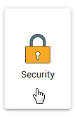
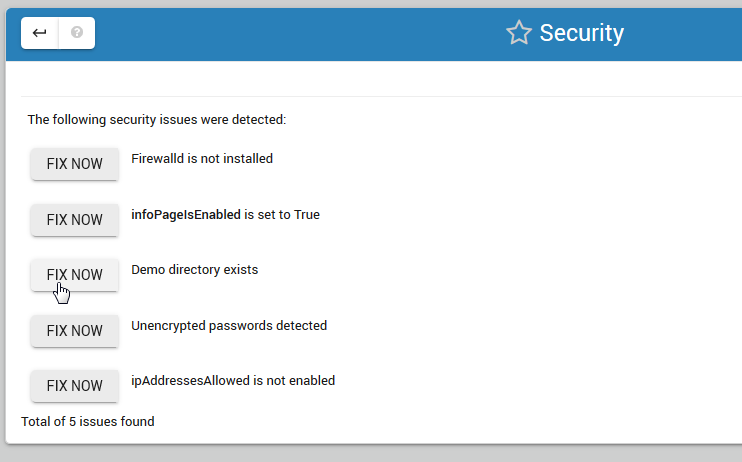

.. This is a comment. Note how any initial comments are moved by
   transforms to after the document title, subtitle, and docinfo.

.. demo.rst from: http://docutils.sourceforge.net/docs/user/rst/demo.txt

.. |EXAMPLE| image:: static/yi_jing_01_chien.jpg
   :width: 1em

**********************
Security Checks
**********************

.. contents:: Table of Contents
Overview
==================

Click the Security tab to open the Security Checks page.

This will open the screen below.  

Checks
================

The security page evaluates five checks and provides fixes if check fails.

* Firewalld status
* InfoPage status
* Demo directory status
* Password encryption status
* ipAddressesAllowed status

Fixing Security Issues
======================

Whether or not you elect to fix an issue is up to you.

To fix a security issue, simply click the "Fix Now" button as shown.

Firewalld
======================

It's important to limit the IPs that have access to your JRI instance to the database(s) being served.

InfoPage
======================

The info page shows important information and should be disabled.

Clicking the Fix Now button will disable the page in your application.properties file.

Demo Directory 
======================
The demo directory should be deleted in production environments. 

Password Encryption
======================

Clicking the button will encrypt all un-encrypted passwords in your application.properties file.

Whenever a new password is added via a Data Source, you can encrypt via this location.

ipAddressesAllowed
======================
Restrict access to JRI based on IP address

.. note::
    Each time a Data Source password is added via the Data Source tab, you will see the status for password encryption change.  
 
 
Please see https://github.com/daust/JasperReportsIntegration#security for additional information.

 

