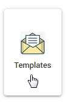
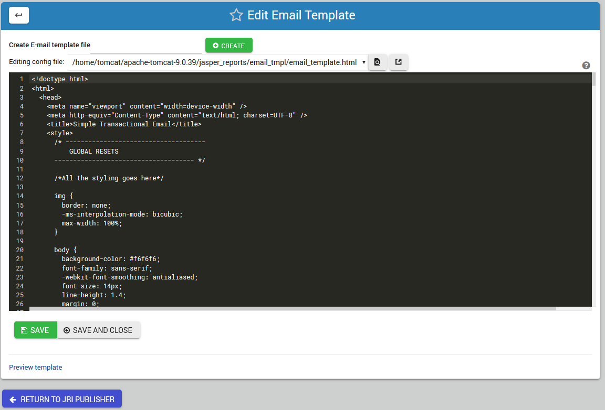
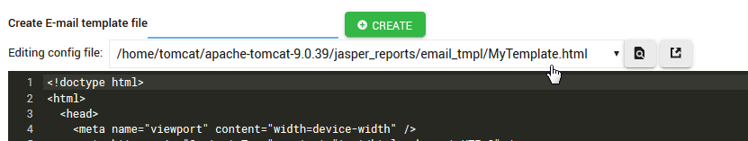
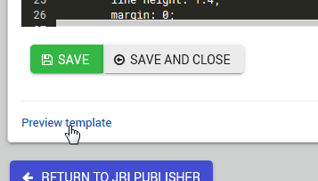
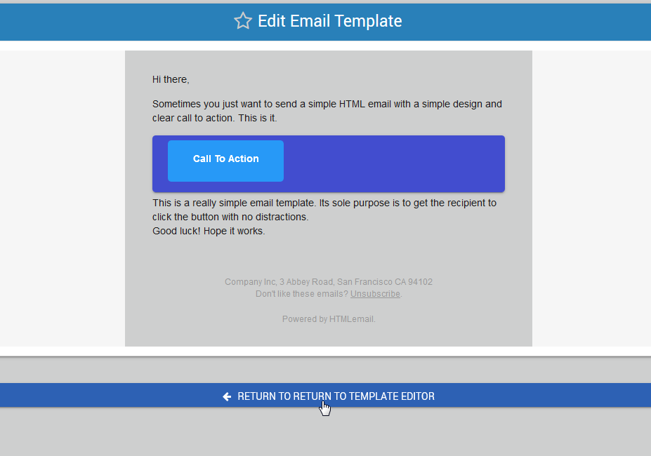

.. This is a comment. Note how any initial comments are moved by
   transforms to after the document title, subtitle, and docinfo.

.. demo.rst from: http://docutils.sourceforge.net/docs/user/rst/demo.txt

.. |EXAMPLE| image:: static/yi_jing_01_chien.jpg
   :width: 1em

**********************
Email Templates
**********************

.. contents:: Table of Contents
Overview
==================

Click the Templates tab to open the Email Templates.

This will open the screen below.  

Template Layout
================

The default template is Lee Munroe's Responsive Email Template:

https://github.com/leemunroe/responsive-html-email-template

Create a Template
=================

To create a new Template, enter the name of the new template and clicking Create as shown below:
 
.. image:: _static/create-template.png

.. note::
    You must include the .html file extension in the name of the template you create.
 
 
The new template you created will now will be loaded into the editor as shown below:
      

Perform your edits and click the Preview Template link as shown below:

To return to the Editor, click the return link as shown below:

.. note::
    The Preview Template function is basic and it is best to run your HTML code to confirm and check your work.

Once you are happy with the template, click the Save button.

Link to edit the Schedule for the report

Using Templates
===============

Templates are assigned by you during schedule creation.

You can use a single template on multiple schedules.  

